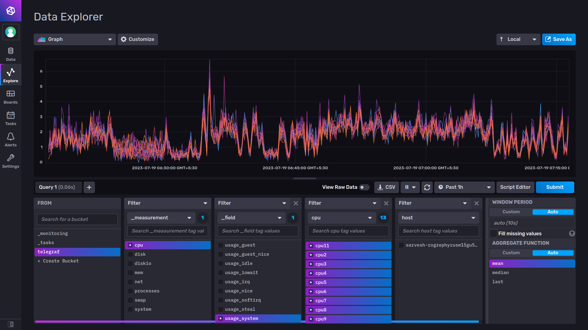
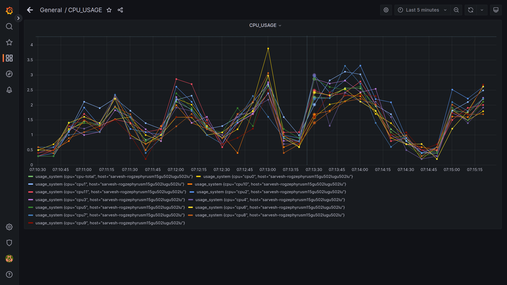
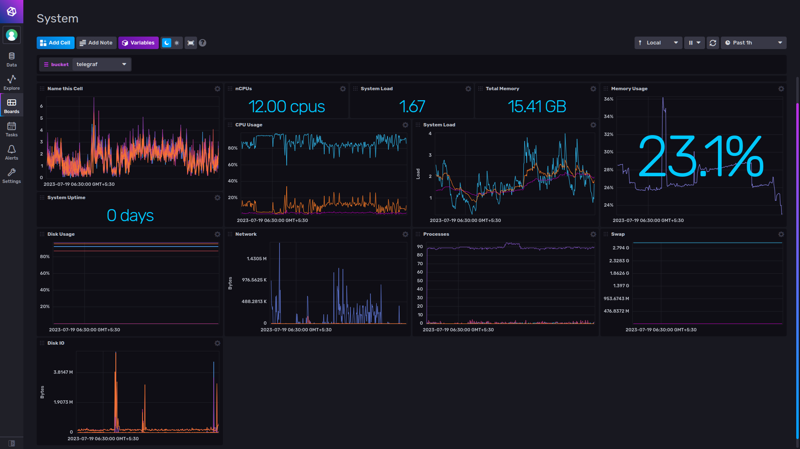

# CPU Usage Monitoring with Grafana and InfluxDB

The project is a system monitoring solution that utilizes Grafana 8, InfluxDB 2, and Telegraf. It provides real-time monitoring and visualization of CPU usage for a system. The solution combines the power of Grafana for creating interactive dashboards, InfluxDB 2 for storing time-series data, and Telegraf for collecting system metrics. 

With this system monitoring setup, users can track and analyze CPU usage trends, identify performance bottlenecks, and gain insights into system health. The interactive dashboards created in Grafana allow users to customize their monitoring views, set alerts, and visualize CPU usage metrics in real-time. InfluxDB 2 serves as the backend database, storing the collected CPU usage data efficiently.

## Visual Example

For a visual example of the project in action, you can refer to this [link](https://drive.google.com/file/d/1I7SYzn8hgakrmYxNI11DsGa6be39YMVw/view?usp=sharing). The example showcases the project's features and functionality in a video format.


## Setup and Configuration:

1. Install Grafana in your local device. Start and enable `grafana.service`. Access Grafana by typing `localhost:3000` in your browser. The default username and password are both __"admin"__, but you can change the password later.

2. For InfluxDB, we will be using a Docker image. Run the following command to start the InfluxDB container:
```bash
docker run -d -p 8086:8086 \
      -v $PWD/data:/var/lib/influxdb2 \
      -v $PWD/config:/etc/influxdb2 \
      -e DOCKER_INFLUXDB_INIT_MODE=setup \
      -e DOCKER_INFLUXDB_INIT_USERNAME=<user> \
      -e DOCKER_INFLUXDB_INIT_PASSWORD=<password> \
      -e DOCKER_INFLUXDB_INIT_ORG=<organisation name> \
      -e DOCKER_INFLUXDB_INIT_BUCKET=telegraf \
      influxdb:2.0

```
#### Note: Replace `<user>`, `<password>`, and `<organisation name>` with your desired values.

3. After running the command, access InfluxDB by typing `localhost:8086` in your browser. Use the username and password you provided when running the Docker command. On the side menu, click on "Data" and find "telegraf". Create a configuration there by selecting "System" and verifying it. Follow the three instructions provided:

- Install Telegraf on your local system (download it according to your distro).
- Configure your API token by running the command provided.
- Start Telegraf by running the command provided.

4. Once you click on __"Listen for Data"__, the connection will be established. Go to __"Explore"__ and you will see Telegraf and various measurements like ___CPU, disks, diskio,___ etc. Select __"CPU"__ and then __"Usage System"__. Choose the CPU cores you want to monitor, and you will see the data visualized in the graph.



5. Next, configure the InfluxDB data source in Grafana. Under "Configuration" -> "Data Sources" -> "Add data source", select "InfluxDB". Fill in the necessary details:
- URL: `http://localhost:8086`
- Query Language: Flux
- Basic Authentication: Uncheck
- InfluxDB Details:
    - Organization Name: Use the organization name you provided when starting the InfluxDB service with the Docker image.
    - Token: Go to "Data" in InfluxDB and use the token found in the user/admin token section.

6. Save and test the data source. Now you can create a new panel in the dashboard, selecting the data source as InfluxDB. Use the Flux query by going to `InfluxDB (8086)`, using the __"Explore"__ section, and the script editor. Copy the script and use it in the Flux query of the Grafana panel.



7. When you save the dashboard in InfluxDB, it will provide you with an overview of system metrics, including metrics from system, mem, diskio, swap, and net measurements. Refer to the Telegraf Documentation for assistance in configuring these plugins.




## License

This project is licensed under the GNU General Public License. See the [LICENSE](https://github.com/Saru2003/CPU-Usage-Monitoring-with-Grafana-and-InfluxDB/blob/main/LICENSE) file for details.
